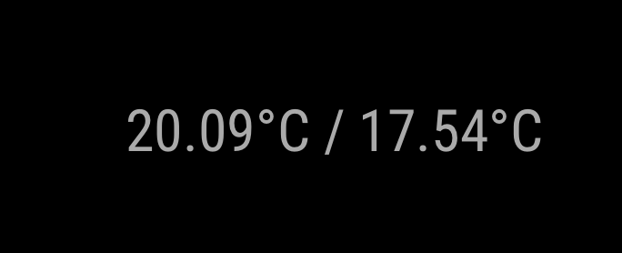
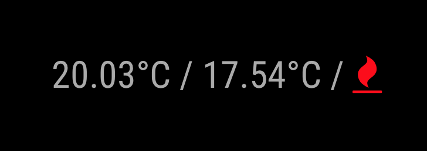

# MagicMirror Module: MMM-Tado-ThermoStats
A MagicMirror Module for displaying your Tado Thermostat data.

## Example

 

### The module displays the current temperature, the set temperature and hopefully in the future a symbol for if your heating is enabled or not:

## Installation

In your terminal, go to your MagicMirror's Module directory:
````
cd ~/MagicMirror/modules
````

Clone this repository:
````
git clone https://github.com/olipayne/MMM-Tado-ThermoStats.git tado
````

Configure the module in your `config/config.js` file. Now takes the metric or imperial as C or F in tempurature output.

## Updating the module

If you want to update your MMM-Tado-ThermoStats module to the latest version, use your terminal to go to your tado module folder and type the following command:

````
git pull
```` 

## Using the module

To use this module, add it to the modules array in the `config/config.js` file:
````javascript
modules: [
                {
                        module: 'tado',
                        position: 'bottom_right',
                        config: {
                                tado_username: 'your@email.com',
                                tado_password: 'youPassword',
                                // tado_home_number: 'yourHomeNumber', // Only needed if you have more than one home on your account
                                // tado_zone_number: 'yourZoneNumber', // Only needed if you have more than one zone on your account
                        }
                },
]
````

## Configuration options

The following properties need to be configured:


<table width="100%">
    <!-- why, markdown... -->
    <thead>
        <tr>
            <th>Option</th>
            <th width="100%">Description</th>
        </tr>
    <thead>
    <tbody>

        <tr>
            <td><code>tado_username</code></td>
            <td><b>Required</b> - Your Tado account username.</td>
        </tr>
        <tr>
            <td><code>tado_password</code></td>
            <td><b>Required</b> - Your Tado account password.</td>
        </tr>
        <tr>
            <td><code>tado_home_number</code></td>
            <td><b>Optional</b> - This is your Tado home ID number. Automatically discovered if you only have one home on your account. Not sure that at the moment you can have more than one home, but the API implies it could be planned for the future by using the data set homes, not home.<br>
            </td>
        </tr>
        <tr>
            <td><code>tado_zone_number</code></td>
            <td><b>Optional</b> - This is your Tado zone ID number. Default is 1, if you have more zones you can change this to select which you want to display. If wanted you can install multiple times and have a different zone for each MMM.<br>
            </td>
        </tr>
    </tbody>
</table>
